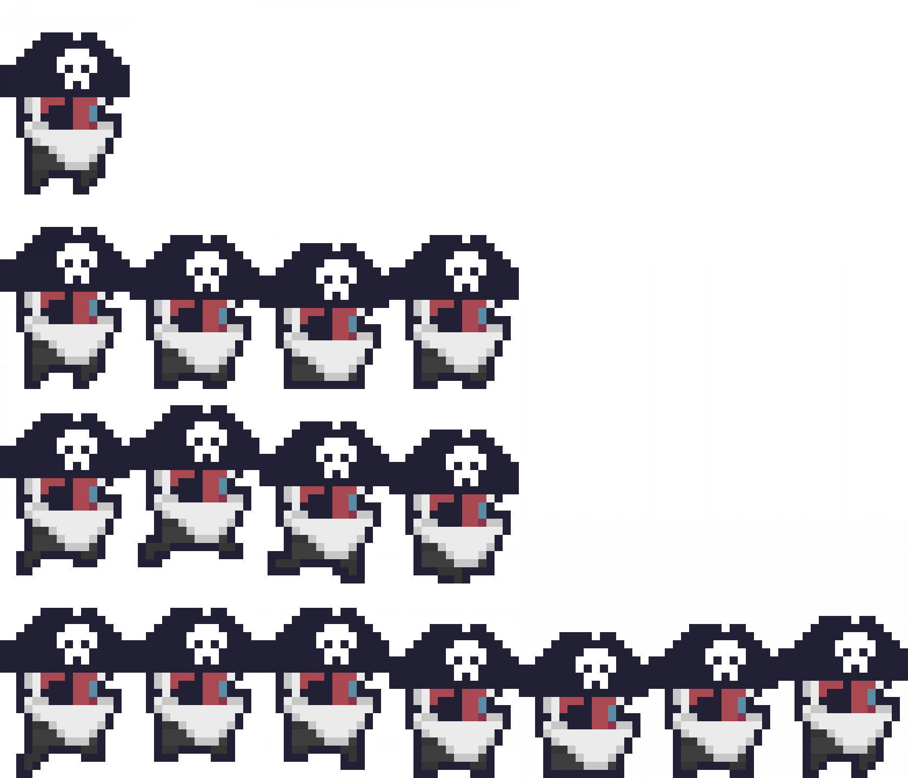

# sprite-sampler

Basic tool used to check that spritesheet animations are working as
expected.

### Usage

Ensure `config.edn` is in working directory and specifies the
following attributes:

- `:width` the width of the sprite (a single frame, not the whole
  spritesheet) in pixels.
- `:height` the height of the sprite.
- `:file` the filename of the spritesheet (relative to the working
  directory).
- `:animations` a map describing the animations in the spritesheet
  keyed by name, each animation consists of:
  - `:frames` the number of animation frames in this animation.
  - `:y-offset` a zero-indexed number specifying which line of the
    spritesheet this animation is on (0 is the top line).
  - `:frame-delay` the number of game updates to wait before moving to
    the next frame of animation.

You can change the background colour of the scene with `up` and
`down`, you can cycle through the sprites available animations with
`space` (note, the order of animations may not match the config file).

### Build and Run

For first time usage you need to build with:

``` shell
lein uberjar
```
Then run with:

``` shell
java -jar target/uberjar/sprite-sampler-1.0.0-standalone.jar
```

You can update `config.edn` between runs

### Example

``` clojure
{:width  240
 :height 360
 :file   "captain.png"
 :animations {:none {:frames      1
                     :y-offset    0
                     :frame-delay 100}
              :idle {:frames      4
                     :y-offset    1
                     :frame-delay 15}
              :run  {:frames      4
                     :y-offset    2
                     :frame-delay 8}
              :jump {:frames      7
                     :y-offset    3
                     :frame-delay 8}}}
```

